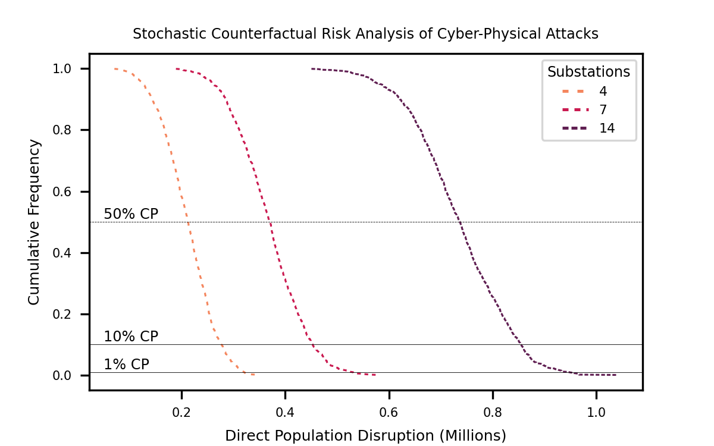

# Summary

This paper details the ``Open Source Infrastructure Risk Analytics (osira)`` codebase which
provides a way to quantify the direct and indirect impacts of infrastructure cascading failure.
For example, resulting from a cyber-attack, flood, earthquake or geomagnetic storm. The
repository name is taken from Wonder Woman where Osira is a fictional Egyptian Goddess
respected for her advanced understanding of technology. Improving our understanding of the
groups of technologies known as 'infrastructure systems' can help us make better decisions,
particularly in relation to risk management.

The fact that industry is increasingly moving toward the development of cyber-physical systems
to deploy intelligent monitoring and control (e.g. smart energy, smart transport etc.) means
we have growing interconnectedness, with serious ramifications for societal resilience.
Increasingly, decision-makers have highlighted the need for simulation-based risk frameworks
which can capture both the direct and indirect socioeconomic impacts of “what if” scenarios.
Despite infrastructure being of growing importance, there are surprisingly few open source,
fully-documented, fully-tested codebases available for risk analysts to use. The contribution
of this repository is to fill this gap.

# Statement of Need

Disruption in electricity supply has major ramifications for both society and the economy.
Risk analysts have a major interest in trying to understand the potential business interuption
impacts in order to protect societ and the economy.

For example, catastrophic events such as cyber-attacks are both a major risk management issue
for governments in order to protect lives and livelihoods. However, where there is risk, there
are also potential business opportunities for the insurance industry, which can also have a
beneficial societal impact by sharing risk [@kelly_integrated_2016].

The literature is full of infrastructure risk papers.

While many researchers are interested in quantifying infrastructrue cascading impacts globally,
we are yet to have a set of open-source software models commensurate with this interest. The
``osira`` repository is released with the aspiration that infrastructure risk analysts can
share code, evaluate each other's models and use them to inform better decision-making in
industry and government.

# Uniqueness

The ``Open Source Infrastructure Risk Analytics (osira)`` is unique because it provides a
generalizable spatially-explicit framework for quantifying direct and indirect disruption from
infrastructure cascading failure. A geospatially explicit system-of-systems infrastructure
model can be defined which reflects dependencies on electricity assets by other transport,
telecoms, water and waste infrastructure systems

As detailed in [@oughton_stochastic_2019], this approach can be integrated into assessments
focusing on threat identification, threat manifestation, quantification of infrastructure
effects, and estimation of wider macroeconomic impacts for different scenarios.

# Spatial units

The model is spatially-explicit, therefore it expects infrastructure assets to be provided as
point geometries based on latitude-longitude coordinates. Preferably, population data can also
be provided at the highest spatial resolution possible.

# The Osira model

Firslty, the model takes electricity assets and estimates the number of people served by each
asset. If a substation fails, this allows estimation of the number of directly affected
households.

Secondly, the model takes the number of other infrastructure assets (transport, telecoms,
water, waste etc.) and estimates which electricity substation they are served by. This enables
quantification of the number of indirectly affected infrastructure assets if an electricity
substation fails.

For a particular scenario, the modeler must specify how many substations are to be selected.
A Monte Carlo process is then carried out based on the number of stated iterations, which
randomly selects substations and quantifies the level of disruption. Hence, cumulative
probabilities can be estimated for different sized events, as per Figure 1 below (see
[@oughton_stochastic_2019] for more details on the method).

# Applications

Understanding interdependent infrastructure systems is essential for resilience engineering
[@hickford_resilience_2018]. Thus, there are many applications which the ``osira`` codebase
can be applied to, particularly given the rise in infrastructure assessment of a single
sector [@oughton_strategic_2018] or all national sectors[@hall_strategic_2016].

For example, assessing cyber-attack risks for infrastructure systems is an important
application demonstrated here [@oughton_stochastic_2019]. While this application results from
malicious activity, natural hazards equally pose threats. Infrastructure assessment is used to
quantify the impacts of flooding [pant_critical_2017], earthquakes [@zorn_quantifying_2016]
and space weather [@oughton_economic_2018].

# Acknowledgements

Thank you to (i) George Mason University for ongoing research support, (ii) valuable feedback
from the paper reviewers. There are no conflicts of interest.

# References
